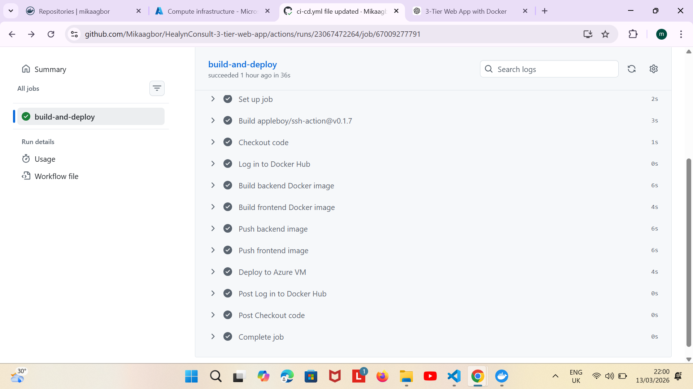
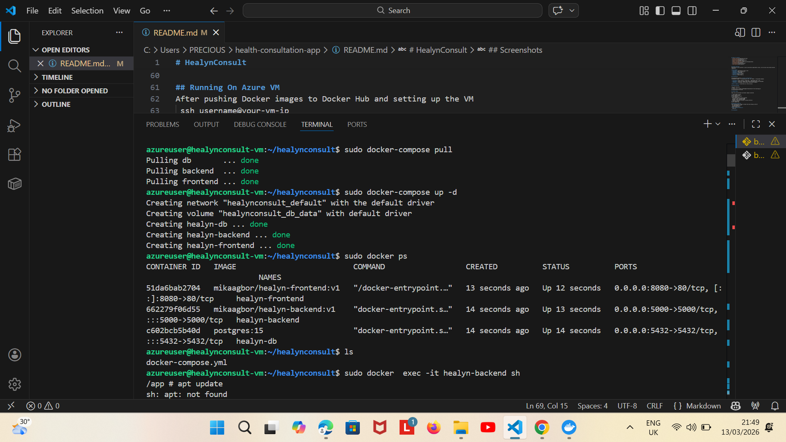
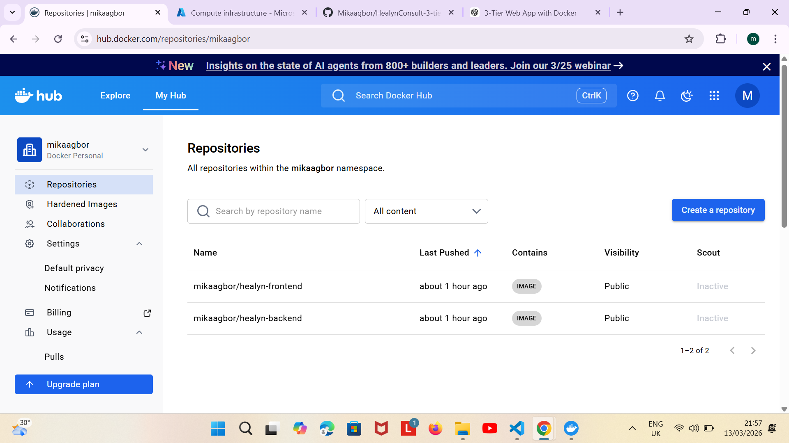
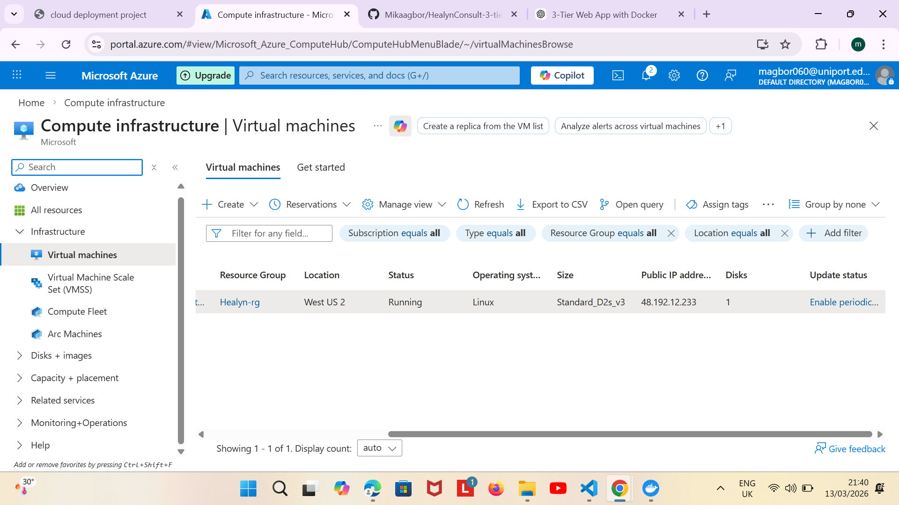

# HealynConsult

This ia a Dockerized 3-Tier web application for HealynConsult, a health consultation platform. It includes **Frontend**, **Backendd** and **PostgreDQL Database**, fully containerized using Docker and deployable on a Linux VM. A GitHub Actions CI/CD pipeline automates building, pushing images to Docker Hub, and deploying to the VM.

## Table of Contents
- [Project Overview](#project-overview)  
- [Architecture](#architecture)
- [Getting Started](#getting-started)
- [Docker Setup](#docker-setup)
- [Running the Application](#running-the-application)
- [Screenshots](#screenshots)
- [CI/CD Workflow](#cicd-workflow)
- [Contributors](#contributors)

## Project Overview
HealynConsult allows patients to book consultation appointments online, view services and provide personal complaints.

**Tech Stack**
- **Frontend:** HTML/CSS/JS (static site)
- **Backend:** Node.js/Express.js
- **Database:** PostgreSQL
- **Containerization:** Docker
- **CI/CD:** GitHub Actions
- **Hosting:** Azure Linux VM

## Architecture

The application follows a **3-tier architecture**:
Frontend(Port 8080) <-> Backend(Express API, Port 5000) <-> PostgreSQL Database

- **Frontend:** Static website ('index.html', 'appointment.html', etc)
- **Backend:** 'server.js' handles API routes and communicates with PostgreSQL
- **Database:** PostgreSQL stores patient consultation requests

**Docker Compose:** orchestrates all three services.

## Getting Started

Clone the repository
'''bash
git clone https://github.com/Mikaagbor/HealynConsult-3-tier-web-app.git
cd HealynConsult-3-tier-app

## Docker Setup

Make sure you have Docker and Docker Compose installed.

1. Build Images Locally
docker-compose build
2. Run Containers Locally
docker-compose up
  Your services should now be running:
. Frontend: http://localhost:8080
. backend: http://localhost:5000/
. Database: PostgreSQL container running internally
3. Stop containers
docker-compose down

## Running On Azure VM
After pushing Docker images to Docker Hub and setting up the VM
 ssh username@your-vm-ip
 cd /path/to/project
 docker-compose up -d
**check running containers**
  docker ps

## Screenshots

### CI/CD pipeline success

### Docker Containers Running

### Docker Hub Images

### Live Application

### Azure VM Running

## CI/CD Workflow

A GitHub Actions Workflow automates:
1. Build Docker images for frontend and backend
2. Push images to Docker Hub
3. SSH into Azure VM
4. Deploy cntainers using Docker Compose

**GitHub Secrets Required**
- DOCKER_HUB_USERNAME
- DOCKER_HUB_PASSWORD
- VM_HOST
- VM_USERNAME
- VM_PASSWORD (if using password authentication)

## Contributors
**Agbor Mika David**: Project Lead and Developer

## License

This project is for educational purposes and follows the TechCrush Capstone project guidelines
